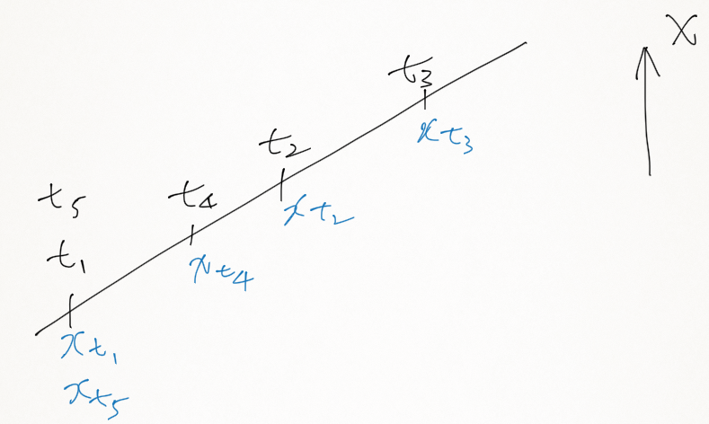
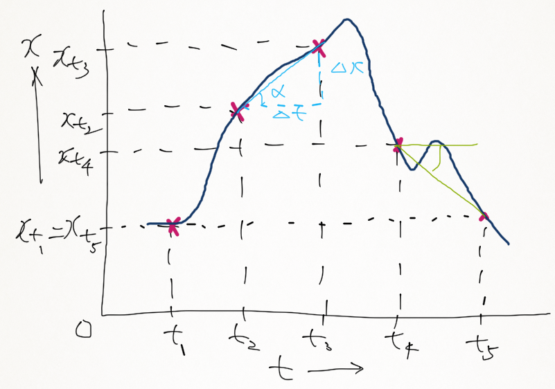
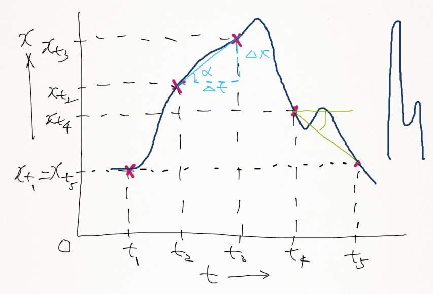
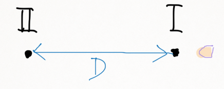
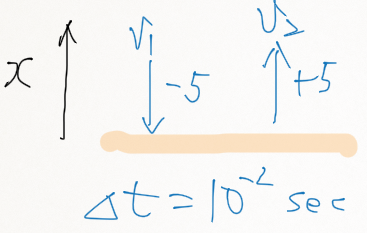
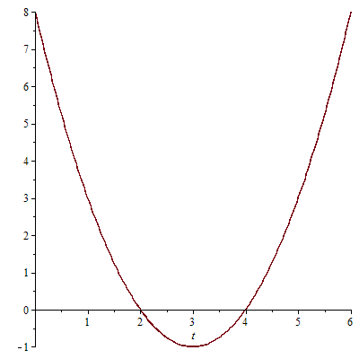

# Lecture 02: Introduction to Kinematics

Walter Lewin, 8.01 Physics I: Classical Mechanics, Fall 1999. 
(Massachusetts Institute of Technology: MIT OpenCourseWare). 
[http://ocw.mit.edu][1] (accessed 04 08, 2013). 
License: Creative Commons Attribution-Noncommercial-Share Alike.

## Introduction to 1-Dimensional Motion

We will discuss velocities and acceleration.

I'll start with something simple.

I have a motion of an object along a straight line--

we'll call that one-dimensional motion.

And I'll tell you that the object is here at time t1.

At time t2, it's here.

At time t3, it's there.

At time t4, it's here and at time t5, it's back where it was at t1.

And here you see the positions in x where it is located at that moment in time.

I will define this to be the increasing value of x.

It's my free choice, but I've chosen this now.

Now we will introduce what we call the __average velocity__.

I put a bar over it.

That stands for average between time t1 and time t2.

That we define in physics as x at time t2 minus x at time t1 divided by t2 minus t1.

That is our definition.

In our case, because of the way that I define the increasing value of x, this is larger than 0.

However, if I take the average velocity between t1 and t5 that would be 0, because they are at the same position so the upstairs is 0.

If I had chosen t4 and t2--average velocity between time t2 and t4--you would have seen that that is negative because the upstairs is negative.

Notice that I haven't told you where I choose my zero on my x axis.

It's completely unimportant for the average velocity.

It makes no difference.

However, if I had chosen this to be the direction of increasing x then, of course, the signs would flip.

Then this would have been negative and this would have been positive.

So __the direction__, that you are free to choose __determines the signs__.

__The location where you put your zero is not important but signs in physics do matter.__

Signs are important.

Whether you owe me money or I owe you money the difference is only a minus sign but I think it's important for you.

Now I will give you not only the positions--
as I did here on the x axis at discrete moments in time--
but I'm going to tell you exactly where the object is at any moment in time.

Here you see an x-t diagram so you see that at t1, the object is at position xt1.

This is the road of the object.

This is the straight line, where it's moving.

It starts here and it goes to this position.

It goes to this one, it comes back to t4 and it comes back here.

I will tell you now every moment in time in between.

And there it goes.

Voila.

This is now information that is way more.

You have the information at any moment in time.

Notice that I now did choose x = 0.

I chose it somewhere here but I could have chosen it at any other point--for whatever follows you will see that it makes no difference--so I have chosen a zero point so that I can make a graph.

And now we will look at the average velocity in a somewhat different way.

Say I choose my time t2 and t3.

I draw here now this line.

And this angle I call alpha and this part here I call delta x and this here is delta t.

And so you could right now--

if you're careful about your sign convention--

you could write down now that the average velocity equals delta x divided by delta t.

But be careful.

If the angle is positive--

I call this a positive angle--

then the average velocity is positive but if I have a negative angle then the average velocity would be negative.

For instance, between t4 and t5, if I draw this line then this angle here is negative and so the average velocity between t4 and t5 is now negative.

Again, if I had changed the zero points you would have found the same values for the average velocity.

The only difference would have been the position of the curve in that plot.

## Average Speed vs. Average Velocity

There is a very big difference in physics between speed and velocity.

The average velocity between time t1 and t5 is zero but the average speed is not.

__The average speed is defined as the distance traveled divided by the time that it takes to travel that distance.__

Now, what is the distance that the object traveled between time t1 and time t5? 

Well, the object started at a position here on this x axis and then it went up, reached the highest point here so I'll make a drawing for you here.

It reached the highest point here, then it went down.

And then when it went here it went up again and comes down again and it's back.

And in order to find the average speed you would now have to know exactly what this distance is add up this distance add up this distance and this distance.

And if that distance altogether were, for instance, 300 meters and if the time between t1 and t5 were 3 seconds then the average speed would be 300 meters divided by 3 seconds.

That would be 100 meters per second so the average speed would be 100 meters per second yet the average velocity would be zero.

## Instantaneous Velocity

If you look at the location t3 and t2 and I bring t3 closer and closer to t2 then this angle of alpha will increase and I can go to the extreme that I bring t3 almost right at t2.

The angle of alpha will then be tangential to this point.

This will then be my angle of alpha.

And now you will understand how we define the __instantaneous velocity at time t__ which is different from an average velocity between two time intervals.

The instantaneous velocity, v--
and I pick a random time, t--
equals the limiting case for x measured at time t plus delta t minus x measured at time t divided by delta t and I do that for delta t--goes to zero.

So think of this as being t3 and this as t2.

I bring t3 closer and closer and closer to t2 and the time between them then goes to zero.

And this is something that you undoubtedly recognize.

That's the first derivative of the position versus time.

And now comes an equation which is one of the very few that I want you to remember in x...in 8.01: 

This is one that you must remember, not only in 8.01 but for the rest of your time at MIT.

And this could be larger than 0, this could be 0, and this could be smaller than 0.

If the angle of alpha, the tangential, is positive then it is a positive value.

If it is negative, however, when you're here then it is a negative velocity.

And if the angle of alpha is zero then the velocity is zero.

So if we now look at this plot we can search for the times that the velocity is zero so you have to look for the derivative being zero.

That means the angle alpha being zero.

Clearly, here the velocity is zero.

Right here, at this turning point--

that means when the object is here--

it is zero.

When the object is here it is again zero at this moment in time.

Again, the angle is zero, and it is again zero here.

So those are the times that the velocity is zero.

What are the times that the velocity is positive? Well, it's positive here.

The velocity's positive here still positive, positive, becomes negative negative, positive, zero, negative.

So that's the definition of v, instantaneous velocity.

What is the instantaneous speed? Well, speed is not sign-sensitive.

Suppose that the velocity here--

just...

I call that v1--

suppose that was +30 m/s.

I just grabbed this number out of the blue.

And suppose here, somewhere, it was...

I call that v2--

suppose that was -100 m/s.

This is negative and this is positive.

Then we would have to say, in physics--

whether you like it or not, it's not very pleasing--

but you would have to say that this velocity is lower than that one because -100 is lower than +30.

But the speed, of course, is higher here because __the speed is the magnitude of the velocity and is not sign-sensitive.__

So this has the highest speed, of 100 m/s and this has a lower speed but this has the lowest velocity.

It's just an algebraic game but very important when you make your calculations.

## Measuring the Average Speed of a Bullet

I have always wondered what the average speed or the average velocity is of a bullet.

Now I want you to realize I am not a fan of guns at all but it always intrigued me.

How can I measure the average speed of a bullet--

and I have discussed it with some people here--

and we came up with an easy way to do that.

We have a wire, which goes into the blackboards, wire I and we have another wire that goes into the blackboards, wire II, and the separation is D meters.

We have to measure that.

The set-up is here so this is wire number I and this is wire number II.

So you will see D coming in like this, so I'll make this a I and I'll make this a II.

That's the way it's set up.

And we fire the bullet, which breaks this wire.

At that moment, the timer starts and then it breaks this wire and that's when the timer stops.

Now, I told you a measurement is meaningless without knowledge of the uncertainty in your measurement.

So there are two uncertainties involved--

the distance and the timing uncertainty.

This distance I will measure for you, D.

I have here a large ruler.

Here's one wire, here's the other wire.

I cannot do that any better, really than maybe even half a centimeter because the situation is not all that stable--

I don't know what happens when the bullet will hit the wire--

so I would say it is 148 and a half centimeters but I cannot guarantee it to better than half a centimeter--

I want you to appreciate that this is a very small percentage error.

This is only 5 parts out of 1,500.

That is 1/300, so that is only a 1/3% error.

That's very small--

that's what we call the relative error.

Then I ask myself the question--

I want to measure the accuracy of the speed of the bullet to about 2%.

That was my goal.

How accurate should I do the timing? Well, I had to make an estimate very roughly how fast the speed of the bullet is and I would think it is probably lower than the speed of sound.

The speed of sound is 340 m/s.

I don't know whether it's 200 or 300 but it's got to be somewhere in that ballpark of the kind of bullets that we have--

200 or 300 m/s.

Let us assume that the speed is 300 m/s--

just a wild guess.

Then it would take 5 ms for this bullet to cross from here to here.

And if I want to make a measurement to 2% accuracy I have to know this timing to about 1/10 ms because 1/10 ms is about 2% of 5.

So that sets the accuracy that I need to make the time measurements.

And so we do have a timer.

It is about accurate to about a 1/10 ms and so now I can measure that time.

So I am going to have here some time that we measure plus or minus 0.1 and we'll do the whole thing in ms.

But our final answer will be in m/s.

All right, I always have to think hard when I do this because when we deal with bullets, that is no kid stuff and I...

as I said I have really no experience firing guns.

This is the bolt.

There we go.

Here's the bolt.

There we go.

It's in place.

Before I do that, I want to check...

check the circuits.

I want to make sure that the electronic circuit is properly working.

You see the timing here, right? 

So I do a small test just to see whether the circuit is working.

Yep, should be working.

Here comes the bullet.

You ready? I'm ready.

Three, two, one, zero.

`[ bullet whacks metal ]`

What do we see?

5.8 ms.

5.8.

Is that what you see? 

Yeah? 5.8 ms.

5.8 plus or minus 0.1.

So out comes the average.

Call it speed or call it velocity it's the same thing in this case.

148.5, 5.8, and I have to convert it to meters per second.

That brings it at 256, plus or minus.

Now you come in here, with your plus or minuses.

This is a one point...

1/3% error.

It's negligible to this one.

One out of 58 is about 1.7% so this is the only one we have to worry about so the uncertainty in there is about 1.7%.

It's less than 2--

that's what I wanted and it gives me an error of about 4 m/s.

And so this is the result.

And you see, it's only meaningful because we have a good idea about the uncertainties in the measurement.

## Introducing Average Acceleration

Just as we introduced average velocity now I am going to introduce average acceleration.

Notice that the velocity changes here throughout time.

And that brings me to the next part the logical part, namely, that we are going to introduce an average acceleration and with a little bit of imagination you can probably guess what that looks like.

The average acceleration between time t1 and time t2 would then be the velocity at time t2 minus the velocity at time t1, divided by t2 minus t1.

And the dimension is lengths per time squared so it's meters per second squared.

This is done for a one-dimensional situation.

This number can be larger than zero, it can be equal to zero and it can be smaller than zero.

In our case, t1 to t2 here notice the velocity is zero as a start.

And it begins to increase because this angle of alpha increases.

It's the angle that matters.

The angle increases, so in our case from t1 to t2 the average acceleration is larger than zero.

Look at the angle.

However, if you take the average acceleration between t1 and t5 that is smaller than zero because here the velocity is zero but here the velocity is negative.

So if you substitute that in there you get an average acceleration which is smaller than zero.

So the signs in the velocity and the signs in average acceleration depend crucially on how I have defined my increasing value of x not where I choose my zero points.

If I reverse the direction of increasing x then all my signs will change.

So you can also write down then that average acceleration, if you like that is delta v divided by delta t but you must be careful because the delta t is sign-sensitive.

You must obey your sign convention.

I have here a tennis ball and I can bounce this tennis ball, I can throw it down.

And let us assume, just for simplicity that it hits the floor at about 5 m/s and that it's a very, very good tennis ball and that it also bounces back with a velocity of about 5 m/s.

I will choose this to be my increasing value of x and so it hits the floor like this.

That means the velocity at which it hits the floor is -5 m/s.

It bounces off, there it comes and it goes up with +5 m/s.

I call this v1 and I call this v2.

So what, now, is the average acceleration? 

Well, I would have to know the time that it takes for this change in direction.

In other words, we call that the impact time.

I would say, in this case, the impact time delta t is probably about 1/100 s and so my average acceleration would be v2 minus v1-

that is +5 - -5--

that is 10 divided by 10 to the -2 and that is +1,000 m/s^2.

I have observed carefully the signs.

If now I say, "Aha, I don't like this I want to go this--
the value of increasing x." No big deal.

This will become a plus, this will become a minus and then this would become a minus.

So then the acceleration is -1,000 m/s^2.

I have also here a tomato and I have here some eggs.

Now, imagine now that I throw the tomato down or, for that matter, the egg and that they hit the floor at 5 m/s.

I could do that.

They would not come back up.

They would go...

`[blows raspberry]`

So therefore the change in velocity would not be 10--

apart from the sign that you have to think about--

but it would only be 5 m/s.

The impact time would probably be much longer maybe a 1/4 s.

So therefore the average acceleration during the impact would then be only 5 divided by 1/4...

would be something like 20 m/s^2.

Now, whether you call it plus or whether you call it -20 m/s^2 depends on your convention of what you call increasing x.

But the eggs and the tomatoes don't care what you call minus and what you call plus.

Whether the acceleration is -20 m/s^2 or +20 m/s^2 you'd better believe it, the egg will break.

So it's only in your convention that it matters but, of course, the physics will not change.

The eggs couldn't care less what you have chosen for your sign convention.

Something breaks because the magnitude of acceleration becomes too high.

That's why something breaks.

A few days ago, I saw a Sherlock Holmes movie and there was a guy who fell on the floor--

marble floor--

hit his head, was lying there motionless.

And here was Watson, and Watson said to Sherlock Holmes "What happened?" Sherlock Holmes walks over to the guy, touches him and he says, "He crushed his skull." 

He looked very intelligent, I must say, when he said that.

"He crushed his skull." 

And I said, "Gee, that's really physics in action--

It's 8.01 all the way."

`[class laughs]`

A modest...

a really modest velocity when he hits the floor but he hit the floor like a billiard ball.

The guy was bald, for one thing and so the impact time was very short.

And when the impact time is short even if you hit the floor with a modest speed the acceleration is high...

`[blows raspberry]`

And that was too much and so that's why his skull was crushed.

So what matters is this changing velocity and the impact time.

## Instantaneous Acceleration

We now want to make one last step from average acceleration.

We want to go to __the acceleration at any moment in time__ just the way we did that with velocity.

And that now is a natural step.

The acceleration at any moment in time will be the limit for delta t goes to zero for v measured at t plus delta t minus vt divided by delta t.

That is the __instantaneous acceleration__.

And this, you will recognize is the first derivative of velocity versus time which is also the second derivative of position versus time.

And so here comes the second equation that I really want you to remember forever and ever and ever that the acceleration is dv/dt which is also d2x/dt squared.

We can go to our plot and we can ask ourselves the question now: where is the acceleration zero, where is it larger than zero and where is it smaller than zero? 

Because this value can be larger than zero, equal to zero and smaller than zero.

And now you have to be very careful when you try to derive that from this plot.

You have to be very careful because you and I have no good feeling for second derivatives.

Velocity is easy--

all you have to do is looking at alpha.

But when it comes to the second derivative you have to see how alpha is changing.

Well, right here, the velocity is not changing so the acceleration everywhere here must be zero.

Here the velocity is increasing so the acceleration must be larger than zero here.

Here, the velocity is almost constant--

it's almost a straight line.

What does that mean for the acceleration? Zero, exactly.

Here, when it makes this rounding curve the velocity is positive here, but on this side it's negative so what does that mean for the acceleration? 

Negative, you got it.

And so you can now roughly find where the acceleration is positive where it's negative and where it is zero.

## Quadratic Equation of Position in Time

Let's do a straightforward example the way that you could expect it on an assignment or, if you were extraordinarily lucky you might even get something like that on an exam.

Very straightforward.

I'm going to give you the position x as a function of time and then ask you lots of questions about it.

So this example is a working example--

So this tells you where the object is at any moment in time and let this be in meters.

What now is the velocity at any moment in time? 

Well, that's the derivative dx/dt and I use the following--

Then, as most of you should know 

That's all I'm using.

So the derivative of eight is zero.

I get here -6, I get here +2t--

this would be in m/s---

and the acceleration...

I have to take the derivative of the velocity, I get +2.

So notice that the acceleration is constant in time, is not changing but the velocity is changing.

Well, at time t = 0...

just, I will start to probe a little bit.

I want to get a feeling for what this object is doing.

At time t = 0, x is +8, the velocity is -6 m/s and the acceleration equals +2.

I can also ask myself at what time does x = 0? 

What are the times that x is zero? 

Well, I have to solve this second-order equation which is something that you've all done in high school and you will find that that's the case when the time is +2 and when the time is +4.

Take the +2...

that makes this 4.

4 + 8 = 12, -6 x 2, that's 0.

So you see the 2 works and you check that the 4 also works.

Just for my curiosity, when is the velocity zero? 

Oh, that's easy--

that's when this equation is zero so that's when t = 3.

What is, at that moment, the position? 

Well, I substitute t = 3 in here and that gives me -1.

x = -1.

So now I'm ready to plot x as a function of t.

It's, of course, a parabola and I use this information that we have just derived.

So here comes my plot.

Let this be increasing value of x let this be 8 and let this be -1.

This is the time axis.

I have a 0 here and so I want to cover, let's say, about 6 seconds so I have 1, 2, 3, 4, 5, 6.

Now I am going to use this information in order to give you a curve which is similar to that one except this is a simple one--

this is just a parabola.

So I know that at time t = 0 the object is at position 8.

I know that x is zero...

that x is 0 at the time 2 and at the time 4 so the object is here at this time and at this time.

And I know that at time t = 3 it is at position -1, so the object is here.

And I also know that the velocity is 0 so we can check that.

And so if I make this plot now then we would get a curve that's sort of like this and yes, indeed, notice, the velocity here is zero.

The angle alpha equals zero.

The object starts out at t = 0 with a negative velocity.

You can see that--

the object at t = 0 is here.

This is where the object is, I hope you realize that.

The object is never here.

This is the road, this is the one-dimensional track on which the object is sitting.

The object is here and it starts going in this direction.

If it starts going in this direction the velocity must be less than zero and indeed it is, it's -6.

But there is the acceleration which is +2 in this direction.

The acceleration says, "I don't want you to go down. I want you to go up!" 

Well, the velocity says "Sorry, all I can do is slowly, slowly change" and that's what it's doing.

It's slowly changing the velocity and there comes a time that the velocity is zero so the object goes down, the velocity changes and when it is at position -1 it has come to a grinding halt and now it is returning.

This positive value of a is now increasing the velocity and that's what you see.

I therefore bet you a nickel that if you substitute, in that equation, t = 4 that the velocity better be positive.

It has changed from a minus sign to a plus sign because of this positive acceleration.

I bet you a nickel t = 4.

What is x...

uh, what is v? We want to know v.

8 - 6 

+2 m/s

You see? Physics works--

v is now +2 m/s

So all that information is in there but I want you to be able to also digest it.

Don't look at that curve as just some dumb parabola, some dumb curve.

Try to imagine what is happening and only then do you get some insight.

Then you really begin to get it in your brains.

## 1D Motion with Constant Acceleration

I now would like to write down, in most general form the equation for the position and the velocity as a function of time for a one-dimensional motion whereby the acceleration is constant.

So it's going to be one-dimensional again and we have a is going to be a constant.

And so the equation that I write down is the most general way that I can write it down.

So we're going to get 

And notice...

oh, I already erased my example.

My example is gone but you would have seen this was an 8 before and here we had...

uh, what did we have? Minus...

we had -6t and we had + 1t squared.

So you recognize these three...

I can now take the derivative and so I get C2 plus 2C3 times t and then I get the acceleration equals 2C3.

And now we get some insight into these quantities.

Clearly, x1...

C1 is the position of x at time t = 0 for which we often write an x0.

Because when t is zero, that is where x is.

C2 is really the velocity at time t = 0 because when t is zero, that's when C2 is v.

And the acceleration is not changing with time.

It's 2C3, therefore C3 is half the acceleration.

So this gives you some insight in the meaning of these quantities and you can see...

you can read now, some physics in there.

C1, C2, and C3 can independently be either zero, or larger than zero, or negative.

It makes no difference--

each one of these combinations is a valid possibility in physics.

When we have gravity...

an object is influenced by the gravitational acceleration and the gravitational acceleration is a constant.

And we write, often for that gravitational acceleration, the letter "g".

Whether I drop an object or throw it vertically up or I throw it vertically down, it's all one-dimensional.

It becomes two-dimensional when I throw it at an angle.

I keep it one-dimensional 

the acceleration is always the same and that g--

gravitational acceleration--

in Boston is 9.80 meters per second squared and it varies a little bit for different places on Earth.

This gravitational acceleration is independent 

of the mass of the object that I drop, 

of the speed of the object,

of the chemical composition of the object,

of the size of the object and 

of the shape of the object 

assuming that we have no air drag 

assuming that these experiments are done in...in vacuum.

Is it obvious that the gravitational acceleration is independent of all these quantities? 

By no means.

Is it true? 

We think so, but I want you to appreciate that it is not obvious and it can not be proven from first principles.

Remember, last time we dropped an apple from 3 m and we dropped another one from 1.5 m.

And in your second assignment, which you haven't seen yet 

I'm asking you to calculate the gravitational acceleration for me using these both experiments.

And, of course, I want you to also tell me what the uncertainty is in your final answer.

And I'd like to help you a little bit to set it up and also to get these equations in terms of gravity.

Whenever we deal with gravity, we get the g in there.

So suppose here is the object at time t = 0.

It was the apple, and I call that position x zero.

I call that zero, I'm free to choose my zero position and I drop it at zero speed.

I just let it go, because that's the way we did it in class.

The object goes down and it hits the floor.

Well, the general equations, now, which deal in gravity...

If I call this the increasing value of x...

You can choose it differently.

This is my choice today...

is the following.

and 

g now is 9.80 m/s^2.

The velocity, at any moment in time equals  and the acceleration is constant--

it's simply g.

Now, in my case, I have chosen t = 0, x zero, 0 and 

I have chosen this zero, so these go.

And so you see that when the object is here--

which is 3 m below this point--

and you know the time, how long it took to get there that you can now calculate "g" because x would be then 3 m.

That's when it's here.

We made a measurement in class how long it took, so you know the time and so you can come up with a value for g.

And you can do that for both measurements and, of course, I want you to tell me, also what the uncertainty is in those measurements.

Remember that we derived, last time, that C...

that the time that it takes for the apple to fall was 

  

and we never knew what that C was.

I did a demonstration to show you that the time is proportional to the square root of h.

We never knew what that C was.

Now you know, because now you have the equations here and you see that that C simply was the square root of two.

But I could not derive that from my dimensional analysis.

## Strobing an Object in Free Fall

Now I want you to relax and, at the same time get a little bit alert for a change.

Look at this situation, v = gt.

That means when I drop an apple--

and I'm going to drop another one today--

that the velocity increases with time.

So if I strobe this apple while it was falling I would see the separation, when it strobes to increase with time, because the velocity goes up with time.

I have here an apple, or I am going to put an apple up about 3 m from the floor--

3 m.

So the height is 3 m, approximately.

We know from last time, remember, we did it it was about 780 ms to hit the floor.

I will just round it off and I think about it...

about 0.8 s, just to get an idea.

If I flash it, if I strobe it twice per second--

we call that two hertz--

so my strobe is 2 / sec.

Then I should hit that ball, when it's falling twice with my strobe light.

I don't know where it is, though because when we strobe it and when I let the apple go the two are not synchronized, so maybe the first time that the light blinks, it may be here and the second time, it may be here.

But it's also possible that the first time it's here and the second time, it's there.

And so the first thing I want to do is to test your alertness.

We will blink.

You will tell me where you see them.

But we will take a picture.

We will take a picture which will show us exactly where those two balls were.

So that's the first alertness test.

So get ready for this, and then we will do a second one which is even more intriguing.

So now I have to first lower this velvet so that we get a nice dark background.

There we go.

`[whooshes]`

Wow, with my fingerprints on it, it's not so black any more.

There it is...

that's the background.

Oh, what am I doing? I need the ladder again--

I have to bring the apple up!

Friday's always a bad day for me.

Okay...

so now I am going to bring the apple up.

There's some metal here, there are electromagnets and so I throw a switch here so that the electromagnet is activated.

Very similar to what we did last time.

We have to put the apple up and the apple is hanging there.

There we go.

So now I have to start the, uh...

The strobe.

That's about 2 Hz, that's about two flashes per second and I'm going to make it pitch black.

Pitch black.

All the lights go off.

I will count down 3, 2, 1, 0 and Bob, there, who is behind the camera will open the shutter when I say "one." And when I say "zero", the ball will fall.

So you may only see the ball in its highest position.

That may not count there, of course because it makes two flashes in the time that the shutter is open and that I drop it.

Okay, if you're ready, I'm ready.

Make it as dark as we can.

Bob, are you ready? Class ready? 

CLASS: Yes.

LEWIN: Everyone ready? You don't look ready.

LEWIN: Okay...

three, two, one.

That was zero.

So let's look at this again in slow motion.

Where's the ball? Oh, boy, you try that trick ten times.

You'll never do that again.

So now we are developing the picture and I would like you to tell me where you saw the balls.

Where were they, roughly? Where was the first one? How much...

how much below the highest point? Only this much? The first one.

And then the second one was pretty low, then.

`[class murmurs]`

Okay, sounds interesting.

We'll take a look.

While the picture is developing, I'm now going to test your real alertness.

I'm going to strobe it with an unknown frequency...

unknown to you.

I will tell you a secret--

it's a higher frequency.

You're going to see more balls on the way down.

I'm not going to ask you where they are, exactly.

All I want you to tell me, afterwards, how many you saw.

That's all.

So count them as it falls.

You know we have only 0.8 seconds to count.

Bob, how did the picture come out?

Wow, you're good! Whoa, you're good.

It was very high, actually...

the first...

the first flash, very high.

You see, it's...

you did very well.

We're going to start, now, with the second part.

Is the audio restored? Should be.

So, I activated the magnet again.

There it is.

Oh, goodness! Working? Okay, thank you, Bob.

Okay, Bob, if you're ready, I'm ready.

We're going to make it as dark as we can.

So all I want you to tell me, how many balls will you see? Oh, oh, oh, oh, I have to change--

oh, my goodness!

`[class laughing]`

`[class murmuring]`

Come on, you're now at MIT!

`[class laughs]`

What do you think? All right, ready? Bob, you're okay? 

BOB: Okay.

LEWIN: Three, two, one...

`[class laughs]`

Well?

Who saw three? 

STUDENT: Four.

Four.

`[class calls out different answers]`

LEWIN: Four, I want to know four.

STUDENT: Seven.

Five? Five, here's a five, there's a five.

Another five? Who saw six? 

STUDENT: Six.

LEWIN: Wow...

seven? Eight? Nine? Ten? Eleven? Who just saw a blur?

`[class laughs]`

Those are the real winners, I think.

Well, I'll tell you, it was 10 Hz.

Since it was 0.8 seconds, depending upon where you hit it how lucky you are, I will show you.

You will either see seven or maybe eight balls but it was a good test.

And for those of you who thought that it was only...

that only saw five, there you see them, let's count them.

Let's count them together.

One, this is one.

Two, three, four, five, six, seven, this is a bounce.

So for those who saw five, I would say "Take some rest this weekend, you need it" and I'll need it, too.

See you Monday.

[1]: http://ocw.mit.edu
